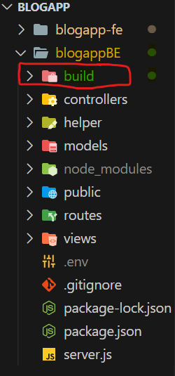
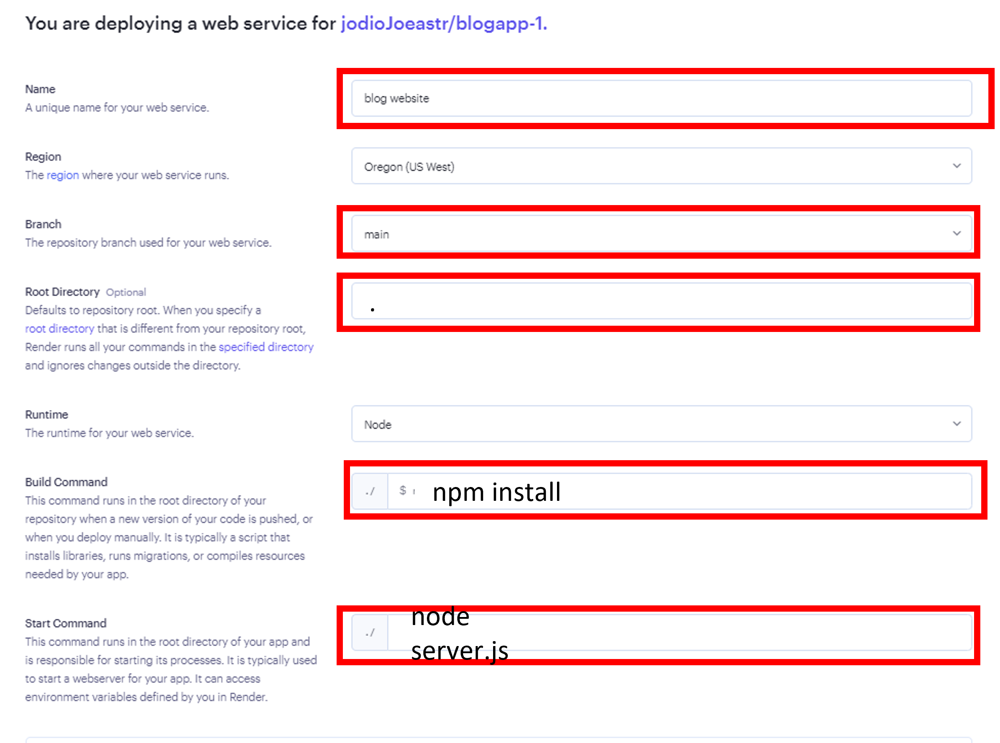
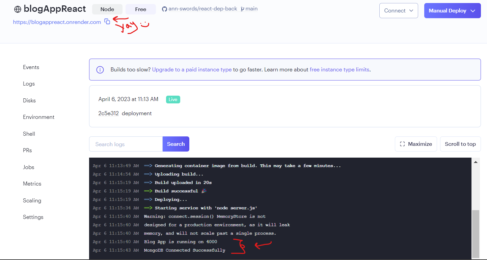

# Deploying a React App with Node.js Express on Render
 
 This guide will walk you through the process of deploying React with node.js application on [Render](https://render.com/).

---
## Prerequisites
+ A code repository for your React app
+ Basic knowledge of React and Node.js
+ A Render account
---

## Steps

 1. Make sure you are resgiterd to [Render](https://render.com/)

    - if you haven't already, Register to Render. You can refer to this tutorial [Deployment on Render](https://git.generalassemb.ly/SEI-03-Bahrain/SEI-03/blob/main/Projects/Project-02/Deployment%20on%20Render.md) to guide through the steps.

2. Open your project folder and setup two terminals. One terminal should be in the frontend and the other should be in the backend. These two terminals will now be referred to as "frontend terminal" and "backend terminal".

3. Inside your frontend ```package.json``` file, add the following "scripts" command under the "build" line: 

    **⚠️Make sure to change ```'/backend/'``` to your backend folder name**

    `"postbuild": "mv build ../backend/",`
    
    


4. Inside your frontend terminal, run the command `npm run build`. You should see a "build" folder created in your backend directory.

    - The command built an `index.html` that will be used in deployment, then the "postbuild" command was triggered and sent the folder into your backend, ready to be pushed to render. This index.html contains all of the magic of React.js that you've built inside the frontend.

    

5. In your `server.js` , add `const path = require('path')` at the very top in your dependencies 

6. In your `server.js` , add the following catch-all route-handler under your mounted api routes.

    `
    app.get('/*', function(req, res) {
    res.sendFile(path.join(__dirname, 'build', 'index.html'));
    });
    `

7. In your `server.js`, add the following lines in your middleware. Replace the old static line with public to the one with build.

    `
    const buildPath = path.join(__dirname, 'build')
    app.use(express.static(buildPath))
    app.use(express.json())
    `

8. Run your backend inside the backend terminal using `nodemon server` or `npm test` or `node server.js` to make sure your app is up and running on your backend port.
    - For example, if my backend is listening to port 4000, then navigating to http://localhost:4000 should have my app in all its glory.
    We're only going to deploy this backend build to render.


9. Commit your changes and push to your code repository.
---
 ## The next steps are done in Render:   

1. Create a new project on Render and select "Web Service" as the type of service.

2. Connect your code repository (GitHub, GitLab, or Bitbucket) to the project.

13. Fill in the necessary details, such as the name of the service, the URL to your code repository, and the port number that your app will listen on.

    

14. Click on "Create Web Service" and wait for Render to deploy your app.

15. Once the deployment is complete, you can access your app at the URL provided by Render.

    

16. Provide your database URL to your Render application
    follow the setpes that are mentioned in the previous [Render Tutorial](https://git.generalassemb.ly/SEI-03-Bahrain/SEI-03/blob/main/Projects/Project-02/Deployment%20on%20Render.md#6-provide-your-database-url-to-your-render-application)  to add all your seceret keys

---
## Conclusion

That's it! You've successfully deployed your React app with Node.js Express on Render🎉. If you encounter any issues or have questions, please refer to the Render documentation or community forums for further assistance. Happy coding!⭐

---
⚡BlogApp Deployed Version: https://blogappreact.onrender.com/ 